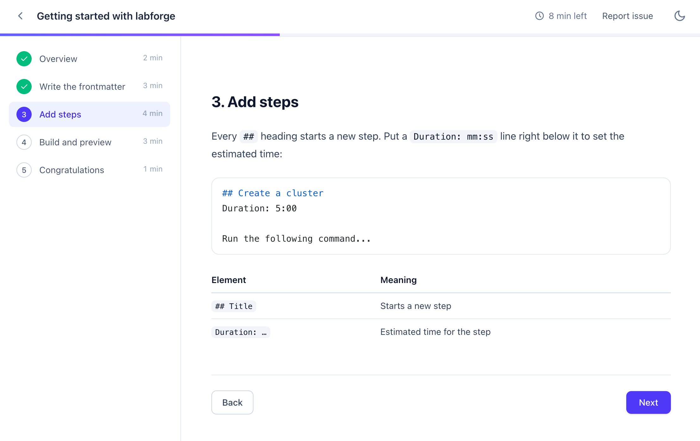
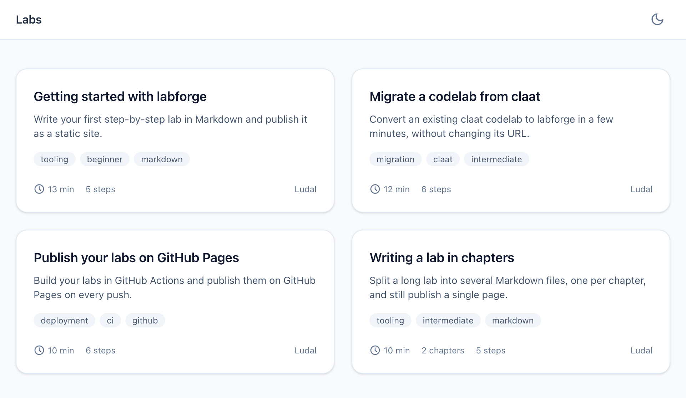

<p align="center">
  
</p>

<h1 align="center">labforge</h1>

<p align="center">
  <strong>Turn Markdown files into beautiful, step-by-step codelabs.</strong><br>
  A modern, zero-config alternative to Google's <code>claat</code>.
</p>

<p align="center">
  <a href="https://www.npmjs.com/package/labforge"></a>
  <a href="LICENSE"></a>
  
</p>

<p align="center">
  <a href="https://iamludal.github.io/labforge/"><strong>Live demo</strong></a> ·
  <a href="docs/authoring.md">Authoring guide</a> ·
  <a href="docs/migrating-from-claat.md">Migrating from claat</a> ·
  <a href="docs/deployment.md">Deployment</a>
</p>

<!-- TODO(media): screenshots of a lab page (same viewport, ~1600x1000, light and dark). -->
<p align="center">
  <picture>
    <source media="(prefers-color-scheme: dark)" srcset="docs/assets/screenshot-lab-dark.png">
    
  </picture>
</p>

---

## 🤔 Why labforge?

Codelabs are a great way to teach: short steps, a clear table of contents, time estimates, and readers who can pick up where they left off. But the reference tool, [`claat`](https://github.com/googlecodelabs/tools), is built around Google Docs, ships as a Go binary, renders with runtime web components, and its repository was **archived in December 2025**.

labforge keeps everything that makes codelabs great and drops the rest:

- **Write plain Markdown** in your editor, review it in pull requests, version it with your code.
- **Run one command** to get a fast, accessible, self-contained static site with a lab catalog.
- **Host it anywhere**: GitHub Pages, GitLab Pages, Netlify, S3, or simply open the files locally.

If you already have claat Markdown codelabs, migration is mostly a matter of converting the metadata header: steps use the same syntax, and lab URLs stay the same. See the [migration guide](docs/migrating-from-claat.md).

## ✨ Features

### 📝 Authoring

- **Plain Markdown with GitHub Flavored Markdown**: tables, task lists, footnotes, strikethrough, autolinks.
- **One `##` heading = one step**, with optional per-step `Duration: mm:ss`.
- **YAML frontmatter** for metadata (title, summary, authors, categories, tags, status, feedback link), validated with clear error messages.
- **Multi-chapter labs**: split a long lab into several files and still publish a single lab.
- **Smart links**: link to another chapter file or step heading as you would on GitHub (`../01-setup.md#install`), and labforge turns it into an in-lab step link.
- **Local images** are resolved relative to each file, copied to the output automatically, and open full screen on click.
- **Syntax highlighting at build time** with [Shiki](https://shiki.style), for every language Shiki supports, in light and dark themes.
- **Drafts**: `status: draft` builds the lab but keeps it out of the catalog.

### 📖 Reader experience

- **Clean, responsive interface** with a step sidebar (a drawer on mobile).
- **Light and dark mode**, following the system preference with a manual toggle.
- **Progress tracking**: completed steps, a progress bar and the remaining time.
- **Resume where you left off**: progress is saved in the browser per step, so editing a lab does not reset it.
- **Shareable step URLs** (`/my-lab/#install-the-cli`) that work with the browser back button.
- **Keyboard navigation**: `←` / `→` to change steps, `Esc` to close the drawer.
- **Accessible**: semantic HTML, skip link, focus management, `prefers-reduced-motion` support.
- **Works without JavaScript**: every step is then displayed on a single page.
- **Optional "Report issue" link** per lab.

### 🚀 Publishing

- **Lab catalog** generated automatically, with summaries, tags, durations, step counts and authors.
- **Self-contained output**: plain HTML, one CSS file and one small script. No CDN, no tracking, no runtime framework.
- **Relative URLs everywhere**: deploy under any sub-path or open the files straight from disk.
- **Safe by default**: Markdown is sanitized, and labforge refuses to wipe an output directory it did not create.

### 🧰 Developer experience

- **Dev server with live reload**: save a file, the browser refreshes.
- **Fast builds** and a tiny CLI with sensible defaults.
- **Ready for CI**: one command, a static folder to deploy.

## ⚡ Quick start

> Requires [Node.js](https://nodejs.org) 20.12 or later.

**1. Install labforge** in your project:

```bash
npm install --save-dev labforge
```

**2. Write a lab** in `labs/hello-world.md`:

````markdown
---
id: hello-world
title: Hello, world
summary: My first labforge lab.
authors: [Jane Doe]
tags: [beginner]
---

# Hello, world

## Overview
Duration: 1:00

In this lab, you will learn how labforge works.

## Run some code
Duration: 2:00

```bash
echo "Hello from labforge"
```

## Congratulations
Duration: 0:30

You finished your first lab!
````

**3. Preview it** with live reload:

```bash
npx labforge serve labs
```

Open <http://localhost:4000>: you get a catalog listing your lab, and the lab itself at `/hello-world/`.

**4. Build the static site**:

```bash
npx labforge build labs -o dist
```

Deploy the `dist` folder to any static host. See the [deployment guide](docs/deployment.md) for ready-to-use GitHub Pages, GitLab Pages and Netlify setups.

> [!TIP]
> Add scripts to your `package.json` so the whole team uses the same commands:
>
> ```json
> {
>   "scripts": {
>     "labs:dev": "labforge serve labs",
>     "labs:build": "labforge build labs -o dist"
>   }
> }
> ```

## 📄 Writing labs

A lab is a Markdown file with a YAML frontmatter. Every `##` heading starts a new step, and an optional `Duration: mm:ss` line right below it sets the estimated time.

| Field        | Required | Description                                                             |
| ------------ | :------: | ----------------------------------------------------------------------- |
| `id`         |   yes    | Lab identifier and output folder name (lowercase letters, digits, `-`). |
| `title`      |   yes    | Lab title.                                                              |
| `summary`    |          | Short description shown in the catalog.                                 |
| `authors`    |          | A name or a list of names.                                              |
| `categories` |          | A category or a list of categories, shown as tags in the catalog.       |
| `tags`       |          | A tag or a list of tags.                                                |
| `status`     |          | `published` (default) or `draft` (built, but hidden from the catalog).  |
| `feedback`   |          | `http(s)` URL of a "Report issue" link shown in the lab header.         |
| `chapters`   |          | Chapter files, relative to the lab file, in reading order.              |

### 📚 Multi-chapter labs

Long labs can be split into one file per chapter. The lab file only holds the frontmatter:

```yaml
---
id: kubernetes-101
title: Kubernetes 101
chapters:
  - 01-setup.md
  - chapters/02-deploy.md
  - chapters/03-scale.md
---
```

Each chapter is a regular Markdown file whose `##` headings are steps. The sidebar groups steps by chapter and shows the progress of each one.

Read the full [authoring guide](docs/authoring.md) for links, images, code blocks, step URLs and more.

## 💻 CLI

```text
Usage: labforge <command> [input-dir] [options]

Commands:
  build [dir]   Build all labs found in dir (default: labs)
  serve [dir]   Build, watch and serve with live reload

Options:
  -o, --out <dir>       Output directory (default: dist)
  -p, --port <port>     Dev server port (default: 4000)
      --accent <color>  Accent color: blue, indigo, teal, green, orange, rose, violet (default: blue)
  -h, --help            Show this help
```

See the [CLI reference](docs/cli.md) for details on lab discovery and the output layout.

## 🚚 Coming from claat?

|                                                      | claat                                     | labforge                                    |
| ---------------------------------------------------- | ----------------------------------------- | ------------------------------------------- |
| Source format                                        | Google Docs or claat Markdown             | Standard Markdown (GFM) + YAML frontmatter  |
| Installation                                         | Go binary                                 | `npm install` / `npx`                       |
| Project status                                       | Archived (read-only since Dec 2025)       | Actively developed                          |
| Lab catalog                                          | Separate project to set up                | Built in                                    |
| Dev server                                           | Static server                             | Live reload                                 |
| Front-end                                            | Web components loaded from a CDN          | Self-contained HTML, CSS and a small script |
| Syntax highlighting                                  | In the browser                            | At build time, light and dark themes        |
| Dark mode                                            | No                                        | Yes                                         |
| Split a lab into several files                       | Fragment imports (content only, no steps) | Chapters, with cross-file links             |
| Resume progress                                      | Last visited step                         | Last step and completed steps               |
| Works without JavaScript                             | No                                        | Yes                                         |
| Google Docs import, analytics, surveys, environments | Yes                                       | No                                          |

Steps (`## Title`) and `Duration: mm:ss` lines carry over unchanged, and labs are still published at `/<id>/`. The [migration guide](docs/migrating-from-claat.md) covers metadata conversion and the few syntax differences.

## 📘 Documentation

- [Authoring guide](docs/authoring.md): lab format, steps, chapters, links, images and code.
- [CLI reference](docs/cli.md): commands, options and output layout.
- [Deployment](docs/deployment.md): GitHub Pages, GitLab Pages, Netlify and other hosts.
- [Migrating from claat](docs/migrating-from-claat.md): step-by-step conversion guide.

<!-- TODO(media): screenshot of the catalog page (~1600x1000). -->
<p align="center">
  
</p>

## 🤝 Contributing

Contributions are welcome! Read the [contributing guide](CONTRIBUTING.md) to set up the project, then open an issue or a pull request. Please follow the [code of conduct](CODE_OF_CONDUCT.md), and report security issues as described in the [security policy](SECURITY.md).

To try your changes on the example labs:

```bash
git clone https://github.com/iamludal/labforge.git
cd labforge
bun install
bun run example
```

## 🤖 Built with AI

In the spirit of transparency: labforge's code and documentation are largely generated with AI coding assistants, under the direction of a human maintainer. Bug reports and code reviews are especially welcome.

## 📜 License

[MIT](LICENSE) © Ludal
